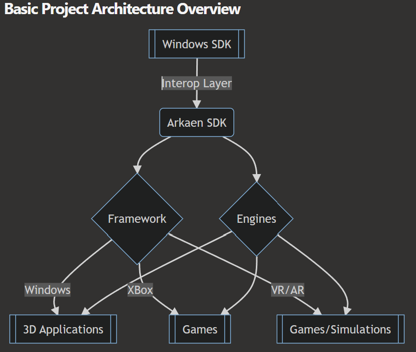

# Project "DXSharp" 
- Modern DirectX 12 for .NET 7 and 8

---

DXSharp is a C# wrapper for the DirectX 12 API and related parts of the Windows SDK.
The motivations for creating "DXSharp" (a temporary codename for prototyping/development) 
were:
- Lack of a modern, light-weight DirectX 12 wrapper in .NET 7 and 8 ...
- The discontinuation of SharpDX, SlimDX, XNA, MDX, etc ...
- Very few choices for experienced .NET engineers to write real-time 3D applications, games, game engines, etc ...
- A need for low-level graphics programming in .NET 7 and 8 and a world dominated by Unity and Unreal Engine ...
- Not enough people learn "real" 3D development anymore, leading to further corporate domination by the "Two Giants" ...
- To build faster, lighter game engines and editors!

